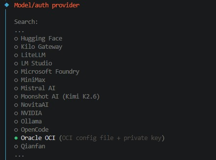
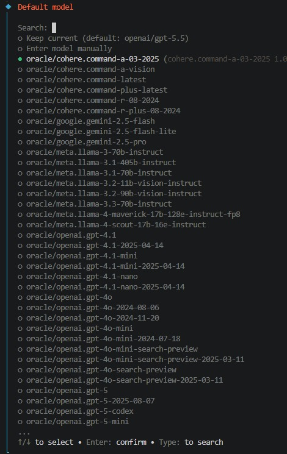

# Oracle GenAI

Use Oracle Cloud Infrastructure Generative AI as an OpenClaw provider. This plugin adds the **Oracle OCI** provider to OpenClaw, authenticates with a standard OCI config file, and automatically discovers the chat models available in your OCI tenancy.

## What This Plugin Does

- Adds **Oracle OCI** to the provider list in OpenClaw
- Uses OCI config-file authentication with optional profile and compartment selection
- Discovers available models automatically from OCI
- Exposes Oracle-hosted model families such as OpenAI, Cohere, Google, Meta, and xAI when they are enabled in your tenancy

## Requirements

- OpenClaw **>= 2026.6.8**
- Node.js **>= 24.17.0**

Node **24.16.x** is not supported. That runtime is known to break Oracle SDK requests after OpenClaw installs its global `undici` dispatcher, which can show up as repeated retries, `[object Object]`, or `fetch failed`. Use **Node 24.17+**. **24.18+** is recommended.

## Setup Experience

After installing the package, the Oracle provider appears in OpenClaw's provider list:



Once Oracle authentication is configured, the plugin lists the models available to that OCI tenancy automatically:



## Install

```bash
openclaw plugins install clawhub:@devprotti/oracle-genai --force
```

## Configure

Configure the Oracle provider in OpenClaw with:

- OCI config file path
- OCI profile name
- OCI compartment id when needed for your tenancy setup

The plugin reads the standard Oracle environment variables used by the provider flow:

- `OCI_CONFIG_FILE`
- `OCI_PROFILE`
- `OCI_CLI_PROFILE`
- `OCI_COMPARTMENT_ID`

## Notes

- Model availability depends on what Oracle exposes in your region and tenancy
- The provider runtime id remains **oracle**, so model refs look like `oracle/openai.gpt-5.5`, `oracle/cohere.command-latest`, and similar
